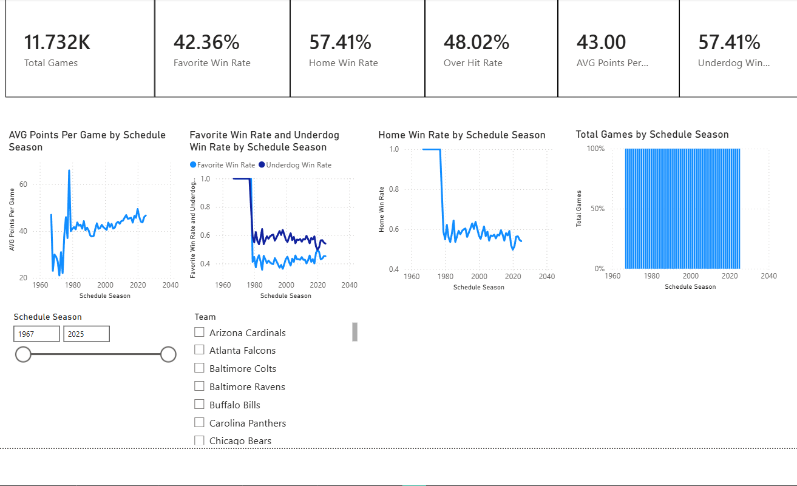
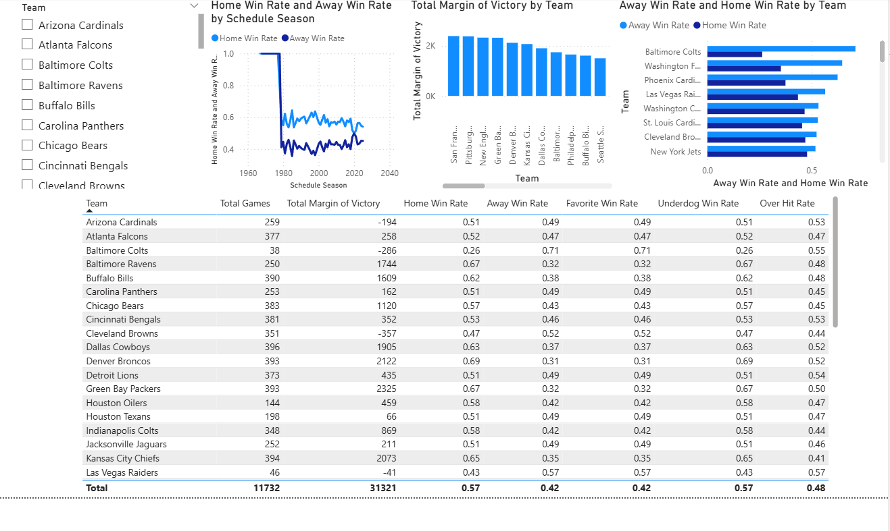
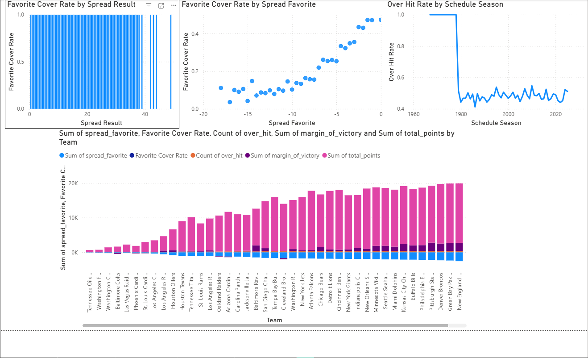
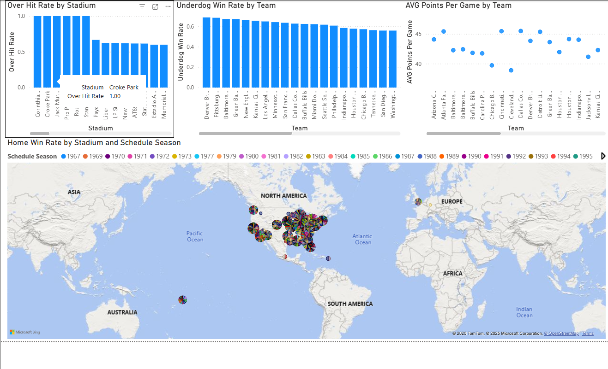

# 🏈 NFL Sports Betting Analytics  
### **End-to-End Data Cleaning • SQL Analysis • Feature Engineering • Power BI Dashboards**

This project delivers a complete data analytics workflow using **Python**, **SQL (SQLite)**, and **Power BI** to analyze over **11,700 NFL games**.  
It reveals insights into team performance, spread efficiency, over/under trends, stadium effects, and long-term bettor edges.

This README is structured to clearly demonstrate **professional analytics skills** to recruiters and hiring managers.

---

# ⭐ Executive Summary

This project analyzes decades of NFL results & betting outcomes to answer questions such as:

- Do **favorites** or **underdogs** perform better long-term?
- Does **home-field advantage** still exist?
- Which teams consistently outperform the spread?
- How do **overs/unders** change across eras?
- Which stadiums affect scoring or win rates?
- What are the strongest **long-term betting edges** in NFL history?

The result is an end-to-end analytics pipeline showing strong competency in:

- Data cleaning & transformation  
- SQL aggregation & logic  
- Feature engineering  
- KPI discovery  
- Dashboard creation  
- Storytelling with data  
- Git & GitHub version control  

---

# 📁 Project Structure

NFL-Sports-Betting-Analytics/
│
├── data/
│ ├── processed/
│ │ ├── nfl_betting.db
│ │ ├── nfl_sports_betting_final.csv
│ │ ├── nfl_teams_cleaned.csv
│ │ └── spreadspoke_scores_cleaned.csv
│ └── raw/
│ ├── nfl_teams.csv
│ └── spreadspoke_scores.csv
│
├── notebooks/
│ ├── 01_exploratory_analysis.ipynb
│ └── 02_sql_analysis.ipynb
│
├── powerbi/
│ ├── figures/
│ │ ├── page1_overview.png
│ │ ├── page2_team_performance.png
│ │ ├── page3_betting_insights.png
│ │ └── page4_advanced_analysis.png
│ └── nfl_sports_betting_powerbi.pbix
│
├── LICENSE
└── README.md

---

# 🧹 1. Data Cleaning & Feature Engineering (Python)

Performed inside **`01_exploratory_analysis.ipynb`**.

### 🔧 Key Cleaning Tasks
- Removed duplicates & invalid rows  
- Standardized team names  
- Converted dates, integers & spread totals  
- Merged multi-source datasets  
- Validated all score columns  

### 🧠 Engineered Betting Features
| Feature | Description |
|--------|-------------|
| `total_points` | Combined score (home + away) |
| `favorite_score` | Final score of the betting favorite |
| `underdog_score` | Final score of the underdog |
| `favorite_is_home` | Whether the home team was the favorite |
| `favorite_covered` | 1 if favorite beat the spread |
| `over_hit` | 1 if total points > over/under line |
| `margin_of_victory` | Absolute score difference |

### 📁 Cleaned Data Outputs
- `nfl_sports_betting_final.csv`  
- `nfl_betting.db` (SQLite database)

---

# 🛢️ 2. SQL Analysis (SQLite)

Performed inside **`02_sql_analysis.ipynb`**.

### ✔ Sample SQL Queries

#### 📌 Total Games Per Season
```sql
SELECT schedule_season, COUNT(*) AS total_games
FROM nfl_sports_betting_final
GROUP BY schedule_season
ORDER BY schedule_season;
```
### 📌 Favorite vs Underdog Cover Rates
```
SELECT 
    AVG(favorite_covered) AS favorite_cover_rate,
    AVG(1 - favorite_covered) AS underdog_cover_rate
FROM nfl_sports_betting_final;
```
### 📌 Over Hit Rate
```
SELECT AVG(over_hit) AS over_hit_rate
FROM nfl_sports_betting_final;
```
### 📌 Team Power Ranking (Margin of Victory)
```
SELECT team_home, AVG(margin_of_victory) AS avg_margin
FROM nfl_sports_betting_final
GROUP BY team_home
ORDER BY avg_margin DESC;
```
### 📊 3. Power BI Dashboards (4 Pages)

#### 📌 Page 1 — League Overview  


#### 📌 Page 2 — Team Performance  


#### 📌 Page 3 — Betting Insights  


#### 📌 Page 4 — Advanced Analysis  


Explores stadium effects, scoring geography, and deeper trend modeling.

🧠 Key Insights From the Analysis
⭐ 1. Underdogs outperform favorites long-term

Underdogs cover the spread ~57% of the time

Favorites cover only ~42%

⭐ 2. Home-field advantage is real—but declining

Historic home win rate: ~57%

In recent eras: significantly lower

⭐ 3. Overs fluctuate heavily by decade

Rule changes impact scoring cycles

Overs hit ~48%, slightly favoring unders

⭐ 4. Certain teams are long-term outliers

Teams like:

49ers

Patriots

Steelers

…show long-term above-average performance metrics.

⭐ 5. Stadium and geography influence outcomes

Certain stadiums show over-friendly scoring

Travel distance affects away win rates

🛠️ Tools & Technologies Used
Category	Tools
Languages	Python, SQL
Libraries	Pandas, NumPy, SQLite3
Database	SQLite
Visualization	Power BI
Environment	Jupyter Notebook, VS Code
Version Control	Git & GitHub
🚀 How to Run This Project
1️⃣ Clone the repo
git clone https://github.com/Jaylundharris/Nfl-Sports-Betting-Analytics.git

2️⃣ Install dependencies
pip install pandas numpy jupyterlab

3️⃣ Run notebooks
jupyter notebook


Run 01_exploratory_analysis.ipynb

Then run 02_sql_analysis.ipynb

4️⃣ Open the Power BI Dashboard

File location:

powerbi/nfl_sports_betting_powerbi.pbix

📌 Future Enhancements

Add machine learning model (spread predictions)

Incorporate live API odds (SportsDataIO or TheOddsAPI)

Create automated refreshable Power BI dashboards

Add player-level prop analysis

Deploy a web dashboard version

📞 Contact

Jaylund Harris

Data Analyst | Python | SQL | Power BI | Sports Analytics

Linkedin: https://www.linkedin.com/in/jaylund-harris-571936384/

GitHub: https://github.com/Jaylundharris